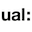

### rebecca-rebecca-rebecca

Greetings :wave:

I am based in the UK studying data science.

I'm interested in creative computing and data visualisation. 

---

 More about me

 

:seedling: **Learning:** 

:books: **Education:** 

